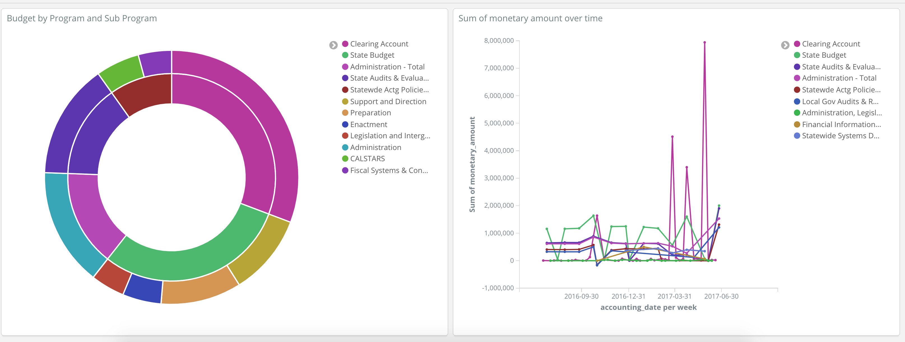

# Fiscal Elastic Kibana

Downloads Fiscal Data (http://fiscalca.opengov.com) and imports it into Elasticsearch.  Kibana is installed to explore the data and create custom visualizations and dashboards.



## Installation

- If you do not have docker and docker-compose, install it/them.
- Start Elasticsearch and Kibana using docker-compose: `docker-compose up`.  
- Wait a minute or two for them to start and connect, then navigate to Kibana: http://localhost:5601 to ensure everything started properly

## Import data

To automatically create the elasticsearch template, pipeline, and index, download the Fiscal data, and start importing, run `./read.sh`.  Once you see the progress indicator, you can start configuring Kibana while the data is importing.

You can import a sample dashboard in Kibana based on this data. In Kibana (http://localhost:5601), do the following:
1. Navigate to the gear icon on the lower left
2. Click on Saved Objects
3. Click import on the top right and select kibana_objects.json in this project.
4. Once it uploads, click import at the bottom.

## Configuring Kibana

This is optional if you did not already import kibana_objects.json

- Navigate to kibana http://localhost:5601 and click Visualize
- You must configure an index pattern.  Just enter `fiscal*` as the pattern.
- Configure `accounting_date` as the Time Filter field name

## Creating a Visualization

You can create many different visualizations based on the data.  Follow the directions below to create your first one to get a feel for it.

- Click 'Visualize' on the left menu and then 'Create a visualization'
- Select 'Pie'
- Select 'fiscal*'
- In the top right, you will see 'Last 15 minutes', click it and select 'Absolute'
- Set the 'From' date to '2016-06-01' and the 'To' date to now
- Under Metrics, click the down arrow and Select 'Sum' as the Aggregation
- Select 'monetary_amount' as as the 'Field'
- Under 'Buckets', click 'Split Slices'.  Select 'Terms' as the 'Aggregation'
- Select 'department_name' as the Field
- Scroll to the bottom and click 'Add sub-buckets'
- Click 'Split Slices'.  Select 'Terms' as the 'Aggregation'
- Select 'program_description' as the Field
- Click the play button at the top of this menu to load the chart

You can 'Save' the visualization at the top of Kibana and then add it to a Dashboard if you like.  You may also want to set the 'Auto-refresh' so that the chart updates as your import continues

## Modifying the csv parser and mappings

The Elasticsearch pipleline was designed for the csv file data format when the project was created.  This may change in the future, and thus the pipeline will need to be updated.

You can see the current pipeline in the file `parse_fiscal_pipeline.json`.  It uses Elasticsearch's grok processor to parse the csv into json.  You can see more information at https://www.elastic.co/guide/en/elasticsearch/reference/6.2/grok-processor.html.

If you wish to modify this processor, you should first use the simulate end point to ensure you have the format correct.  You can try it in Kibana - select 'Dev Tools' and paste the following in the box on the left and click the play button:
```
POST _ingest/pipeline/_simulate
{
 "pipeline": {
   "description": "Parsing fiscal CSV",
   "processors": [
     {
       "grok": {
         "field": "budget",
         "patterns": [
           "(\"%{DATA:business_unit}\")?,(\"%{DATA:agency_name}\")?,(\"%{DATA:department_name}\")?,(\"%{DATA:document_id}\")?,(\"%{DATA:related_document}\")?,(\"%{DATA:accounting_date}\")?,(\"%{DATA:fiscal_year_begin}\")?,(\"%{DATA:fiscal_year_end}\")?,(\"%{DATA:accounting_period}\")?,(\"%{DATA:account}\")?,(\"%{DATA:account_type}\")?,(\"%{DATA:account_category}\")?,(\"%{DATA:account_sub_category}\")?,(\"%{DATA:account_description}\")?,(\"%{DATA:fund_code}\")?,(\"%{DATA:fund_group}\")?,(\"%{DATA:fund_description}\")?,(\"%{DATA:program_code}\")?,(\"%{DATA:program_description}\")?,(\"%{DATA:sub_program_description}\")?,(\"%{DATA:budget_reference}\")?,(\"%{DATA:budget_reference_category}\")?,(\"%{DATA:budget_reference_sub_category}\")?,(\"%{DATA:budget_reference_description}\")?,(\"%{DATA:year_of_enactment}\")?,(\"%{NUMBER:monetary_amount}\")?"
         ]
       }
     },
     {
       "remove": {
         "field": "budget"
       }
     }
   ]
 },
 "docs": [
   {
     "_index": "fiscal",
     "_type": "budget",
     "_id": "AVvJZVQEBr2flFKzrrkr",
     "_score": 1,
     "_source": {
       "budget": "\"8860\",\"General Government\",\"Department of Finance\",\"8860.0000177161.20160831.0\",,\"2016-08-31\",\"2016\",\"2017\",\"2\",\"5342600\",\"Operating Expense & Equipment\",\"Departmental Services\",\"Departmental Services\",\"Departmental Services - Other\",\"0001\",\"General Fund\",\"General Fund\",\"6785019\",\"Statewde Actg Policies, Consul\",\"CALSTARS\",\"001\",\"State Operations\",\"Budget Act\",\"BA State Operations-Support001\",\"2014\",\"-0.0200\""
     }
   }
 ]
}
```
The 'processors' pattern represents the pipeline and the 'docs' represents line of csv data.  You can paste the line in the new file here and play with the pattern until the output looks correct.  Once you have it working, you can modify parse_fiscal_pipeline.json with the new pipeline and re-run `./read.sh`

You may also wish to modify the mapping located in fiscal_template.json to include new fields.  You can check out the Elasticsearch field types here: https://www.elastic.co/guide/en/elasticsearch/reference/6.2/mapping-types.html.

The general pipeline and import setup was modeled after this article: https://www.elastic.co/blog/indexing-csv-elasticsearch-ingest-node.

## Troubleshooting

If while docker is initializing you see a message like "bootstrap checks failed" with "max virtual memory areas vm.max_map_count [65530] likely too low, increase to at least [262144]", the following should fix the issue (run inside of your host linux terminal).
`sudo sysctl -w vm.max_map_count=262144`
